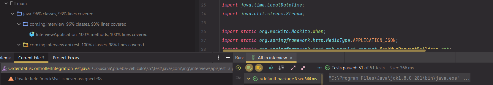
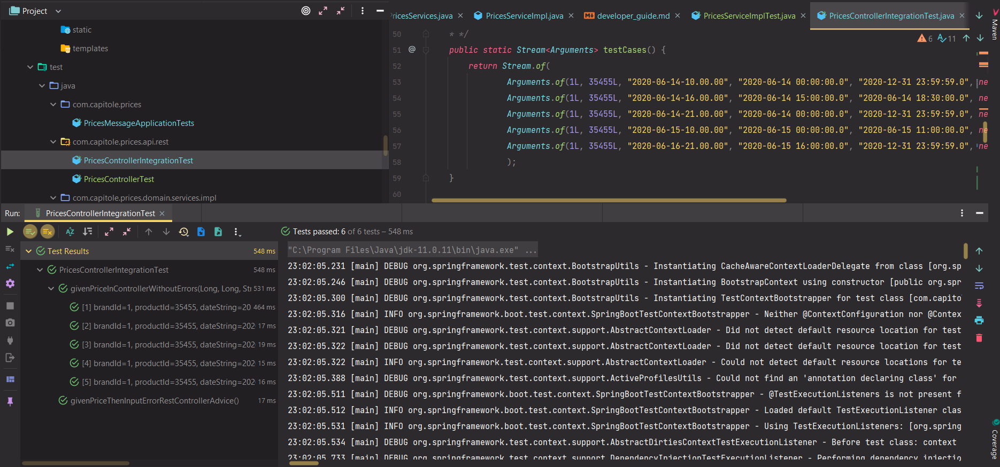
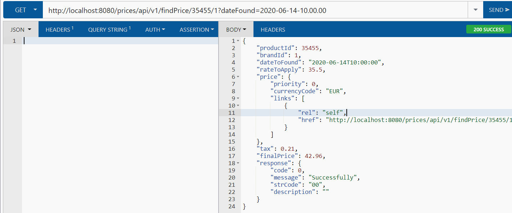
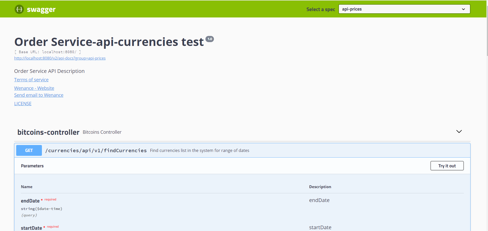

# Cripto Currency Message Service Test  
#System Documentation

The purpose of these documents is to provide an overview of the trade system to a developer. It is assumed that the reader has a minimal understanding how the pricing microservice works for take of price of BITCOIN, knowing that the data is provide for other external microservices, what was configuring its endpoint in the application.properties and a system developer knowledge.

| Writer                | Date       | Version |
| :-------------------- | :--------: | ------: |
| Diego López        | 10/10/2021 | 1.0     |

## Index
- [Cripto Currencies Operation System Documentation](#payments-system-documentation)
    - [Index](#index)
    - [Overview](#overview)
    - [Architecture](#architecture)
    - [Swagger Documentation](#swagger-documentation)

## Overview

A microservice was built in SpringBoot that has two query rest end point that accepts as input parameters: 

1. Accept the application date for the find price in the follow format. yyyy-MM-dd-HH.mm.ss
Example:
   http://localhost:8080/prices/api/v1/findCurrency?dateFound=2021-10-12-10.00.00

2. The second endPoint get the list of currencies what was between two dates.
Example:
   http://localhost:8080/prices/api/v1/findCurrencies?startDate=2021-10-12-10.00.00&endDate=2021-10-12-18.00.00

It returns as output a JsonOutputCriptoCurrency that mainly has: 
the criptoCurrency for the first endpoint, and the response with responseCode=successfully 
and for the second endpoint, that looks startDate, endDate, the average calculate in the range of dates, and percentage difference of this value with the maximun price of the range 
it in the H2 database displayed in memory, the application date with the format specified for the test ' yyyy-mm-dd-HH.MM.ss'.

| Output example:   findCurrency    | 
| :-------------------- | 
| JsonOutputCriptoCurrency      | 
| {
    "criptoCurrency": {
        "id": 193,
        "timeCreated": "2021-10-12-05.54.15",
        "price": 57525.1,
        "criptoCurrencyCode": "BTC",
        "currencyCode": "USD",
        "links": [
            {
                "rel": "self",
                "href": "http://localhost:8080/currencies/api/v1/findCurrency?dateFound=2021-10-12-02.54.15"
            }
        ]
    },
    "averagePrice": null,
    "percentageDifference": null,
    "response": {
        "code": 0,
        "message": "Successfully",
        "strCode": "00",
        "description": ""
    }
}

| Output example:   findCurrencies    | 
| :-------------------- | 
| JsonOutputCriptoCurrency      | 
| {
    "criptoCurrency": null,
    "startDate": "2021-10-12T02:54:15",
    "endDate": "2021-10-12T18:40:00",
    "averagePrice": 56052.97,
    "percentageDifference": 14.72,
    "response": {
        "code": 0,
        "message": "Successfully",
        "strCode": "00",
        "description": ""
    }
}

Spring Hateos was used to refer to the same endpoint, however, this would be really useful if there was another endpoint that found the CriptoCurrency object by id, where in this link, only the link of the object would be referenced and it would facilitate the search for any client that you will need to find this data by id.

Swagger2 was used to generate documentation for the important public endpoints of the controller.

At the end of this document you will find the access link to this document if the application is deployed.

Flyway was used to manage the migration of changes in the database.

@ControllerAdvice was used to centralize exceptions in the controller through the Output JsonOutputCriptoCurrency in the Response object through the use of the ApplicationMessage.UNEXPECTED.

The default format of LocalDateTime was overridden through the SelfConfiguration configuration inheriting from WebMvcConfigurer, to implement a custom format for the date according to what was specified by the test yyyy-MM-dd-HH.mm.ss, which is a format not specified.

Generally I use sonnar to verify the code coverage but I am on a paid plan and I cannot overdo it in projects, so the coverage measurement was done through the Intellij coverage measurement.

The request for the data to the external service was made through the following endpoint.

https://cex.io/api/last_priceBTC/USD 

Configured in two placeholders of the application.properties, providing that in the future the data of some other cryptocurrency can be brought.

These data were saved in the H2 database, through a 10-second configured Schedule configured through the BitcoinsApplicationMessage class where the Spring context is raised, while the application is raised it will save a cryptocurrency object every 10s, Database maintenance was not anticipated for this stage, because it is a test database. In the future you can change the id of the entity to String and pass the entire repository to reactive programming using Mongo.

The validations were carried out through the @ConsistentDateParameter interface, where it is validated that the dates entered by the user or another rest api are not null, they can be instantiated from LocalDateTime, that the start date is not higher than the current date, that the end date is not less than the start date of the range.

In addition, it was configured in the SelfConfiguration class that the dates entered by the user or another application have the expected format for the example yyyy-MM-dd-HH.mm.ss through the implementation of WebMvcConfigurer and overwriting the default format for LocalDateTime

Achieving 93% total coverage of unit tests.

6 Integrated tests were carried out, 5 with the data requesting with the test data of the requirement, and 1 to generate an error if you try to enter the date to search for a String XXXXX.

And all kinds of functional tests were carried out from the google chrome boomerang client rest plugin.

## Swagger Documentation

When running the service you can check the following link to see the specifications of the endpoints used in the following link

http://localhost:8080/swagger-ui.html#/

